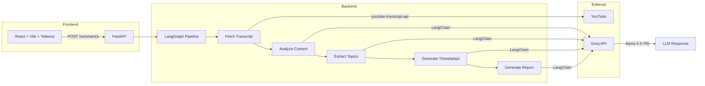

# VideoBrief

**AI-powered YouTube video summarizer** built with LangGraph agents and Groq.

[](https://github.com/YOUR_USERNAME/VideoBrief/actions/workflows/ci.yml)
[](https://python.org)
[](https://react.dev)
[](LICENSE)

Paste a YouTube URL, get a structured markdown report with key themes, topics, timestamps, and takeaways in seconds.

> **Live Demo:** _Coming soon_

---

## Architecture



### Pipeline Stages

| Stage | Description | Output |
|-------|-------------|--------|
| Fetch Transcript | Downloads captions via `youtube-transcript-api` | Raw text + timestamped segments |
| Analyze Content | Identifies themes, sentiment, structure, audience | Analysis summary |
| Extract Topics | Categorizes main topics with key points | Structured topic list |
| Generate Timestamps | Maps topics to video timestamps | `[MM:SS]` timestamp guide |
| Generate Report | Assembles final markdown document | Complete summary report |

---

## Quickstart

### Prerequisites

- Python 3.11+
- Node.js 20+
- [Groq API key](https://console.groq.com)

### 1. Clone and configure

```bash
git clone https://github.com/YOUR_USERNAME/VideoBrief.git
cd VideoBrief

# Set up backend environment
cp backend/.env.example backend/.env
# Edit backend/.env and add your GROQ_API_KEY
```

### 2. Run the backend

```bash
cd backend
python -m venv .venv
source .venv/bin/activate  # Windows: .venv\Scripts\activate
pip install -r requirements.txt
python run.py
```

Backend runs at `http://localhost:8000`.

### 3. Run the frontend

```bash
cd frontend
npm install
npm run dev
```

Frontend runs at `http://localhost:5173`.

### Docker (alternative)

```bash
# Make sure backend/.env has your GROQ_API_KEY
docker compose up --build
```

- Backend: `http://localhost:8000`
- Frontend: `http://localhost:3000`

---

## API Reference

### `POST /summarize`

Summarize a YouTube video.

**Request:**
```json
{
  "url": "https://www.youtube.com/watch?v=dQw4w9WgXcQ"
}
```

**Success Response (200):**
```json
{
  "status": "success",
  "markdown_report": "# Video Summary\n\n## Overview\n...",
  "stages": [
    { "name": "Fetching transcript", "status": "completed" },
    { "name": "Analyzing content", "status": "completed" },
    { "name": "Extracting topics", "status": "completed" },
    { "name": "Generating timestamps", "status": "completed" },
    { "name": "Generating report", "status": "completed" }
  ],
  "metadata": {
    "video_id": "dQw4w9WgXcQ",
    "title": null,
    "url": "https://www.youtube.com/watch?v=dQw4w9WgXcQ"
  }
}
```

**Error Responses:**

| Status | Condition | Detail |
|--------|-----------|--------|
| 422 | Invalid YouTube URL | `"Invalid YouTube URL. Please provide a valid YouTube video link."` |
| 404 | No captions available | `"No transcript available for this video."` |
| 429 | Groq rate limit | `"I'm processing too many requests right now, please wait."` |
| 504 | Processing timeout | `"The video is too long or complex. Try a shorter one."` |

### `GET /health`

**Response (200):**
```json
{
  "status": "ok",
  "groq_configured": true,
  "model": "llama-3.3-70b-versatile"
}
```

---

## Configuration

All backend configuration is via environment variables (or `backend/.env`):

| Variable | Default | Description |
|----------|---------|-------------|
| `GROQ_API_KEY` | _(required)_ | Groq API key |
| `GROQ_MODEL` | `llama-3.3-70b-versatile` | LLM model identifier |
| `LLM_TIMEOUT_SECONDS` | `30` | Per-LLM-call timeout |
| `LLM_TEMPERATURE` | `0.1` | LLM temperature |
| `LLM_MAX_TOKENS` | `1000` | Max tokens per LLM response |
| `AGENT_TIMEOUT_SECONDS` | `120` | Full pipeline timeout |
| `MAX_TRANSCRIPT_LENGTH` | `50000` | Max transcript characters |
| `CORS_ORIGINS` | `http://localhost:3000,http://localhost:5173` | Allowed CORS origins |
| `LOG_LEVEL` | `INFO` | Python logging level |

---

## Testing

### Backend

```bash
cd backend
source .venv/bin/activate
python -m pytest -v                    # Run all tests
python -m pytest --cov=app             # With coverage
```

### Frontend

```bash
cd frontend
npm test                               # Run all tests
npm run test:watch                     # Watch mode
```

---

## Engineering Decisions

| Decision | Choice | Rationale |
|----------|--------|-----------|
| LLM Provider | Groq (Llama 3.3 70B) | Fastest inference for open-source models, free tier available |
| Agent Framework | LangGraph | Explicit state machine with conditional edges, better than chain-of-thought for multi-step pipelines |
| Multi-step vs single-shot | Multi-step (4 LLM calls) | Each stage produces focused output; enables stage-by-stage UI progress; easier to debug individual steps |
| Transcript source | `youtube-transcript-api` | Lightweight, no API key needed, supports multiple languages |
| Frontend state | Custom hook (`useSummarize`) | Simpler than Redux for single-flow state; colocates all summarization logic |
| Styling | Tailwind + glassmorphism | Dark theme with depth via `backdrop-blur`; consistent utility-first styling |
| API client | Axios | Interceptors for error handling, timeout support, cleaner than fetch for structured APIs |
| Docker frontend | Multi-stage (Node build + Nginx serve) | Production-grade static serving with gzip, SPA fallback, security headers |

---

## Project Structure

```
VideoBrief/
├── backend/
│   ├── app/
│   │   ├── agent/          # LangGraph pipeline
│   │   │   ├── graph.py    # StateGraph wiring
│   │   │   ├── state.py    # AgentState TypedDict
│   │   │   └── tools.py    # LLM tool functions
│   │   ├── routes/         # FastAPI endpoints
│   │   ├── services/       # YouTube + Groq clients
│   │   ├── config.py       # Pydantic settings
│   │   ├── models.py       # Request/response models
│   │   └── main.py         # App factory
│   ├── tests/              # pytest suite
│   ├── requirements.txt
│   └── Dockerfile
├── frontend/
│   ├── src/
│   │   ├── components/     # React components
│   │   ├── hooks/          # useSummarize
│   │   ├── api/            # Axios client
│   │   └── utils/          # YouTube helpers
│   ├── package.json
│   └── Dockerfile
├── docker-compose.yml
└── .github/workflows/ci.yml
```

---

## License

[MIT](LICENSE)
